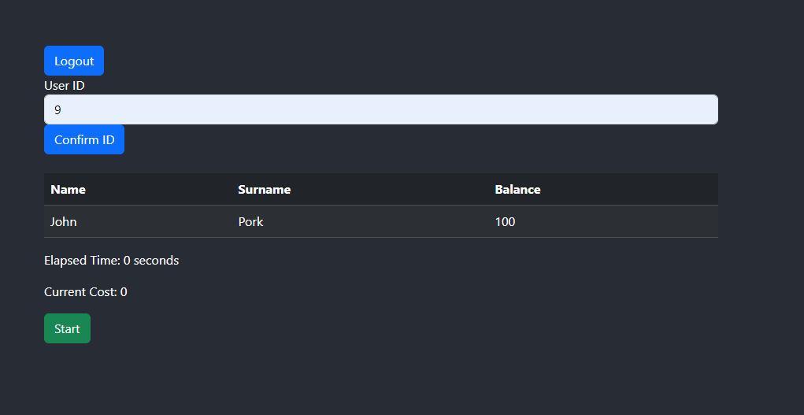

# AZPECA

## Table of Contents
- [AZPECA](#azpeca)
  - [Table of Contents](#table-of-contents)
  - [About ](#about-)
  - [Getting Started ](#getting-started-)
    - [Prerequisites ](#prerequisites-)
    - [Installing](#installing)
    - [Usage](#usage)
    - [Built Using](#built-using)
    - [Screenshots](#screenshots)

## About <a name="about"></a>
AZPECA is a web-based timer application. It leverages the power of React for the frontend and Azure Functions with C# for the backend. The application is designed to provide a simple and intuitive interface for users to manage their usage of public transport time effectively.

## Getting Started <a name="getting-started"></a>
These instructions will get you a copy of the project up and running on your local machine for development and testing purposes.

### Prerequisites <a name="prerequisites"></a>
You need to have the following installed:
+ [Node.js](https://nodejs.org/en/download/)
+ [Azure Functions Core Tools](https://docs.microsoft.com/en-us/azure/azure-functions/functions-run-local?tabs=windows%2Ccsharp%2Cbash)


### Installing
1. Clone the project from git by running the following command:
   ```sh
   git clone https://github.com/PKrystian/AZPECA.git
   ```
2. Navigate to the project directory and install the dependencies for the React app:
    ```sh
    cd AZPECA
    cd client
    npm install
    ```
3. Start the React app:
    ```sh
    npm start
    ```
4. Create a local-params.json file in server directory, format:
   ```json
   {
        "ConnectionStrings": {
            "UserDb": "DB-CON-KEY"
        }
    }
   ```

5. Open a new terminal, navigate to the Azure Functions directory, and start the Azure Functions app:
    ```sh
    cd ..
    cd server
    func start
    ```
### Usage
The application is straightforward to use. Users can start and stop the timer as per their needs. The remaining balance is displayed prominently, providing real-time feedback. Once the remaining balance reaches zero, the timer cannot be started again until it's reset. This feature ensures that users are aware of their time usage and encourages effective time management.

For administrators, there is an admin panel available. This panel allows admins to manage users, view their time usage, and reset timers if necessary. The admin panel is designed to provide a comprehensive overview of user activity and to facilitate efficient management of the application.

### Built Using
The project is built using the following technologies and tools:

- React
- Azure Functions
- C#
- Node.js

### Screenshots

